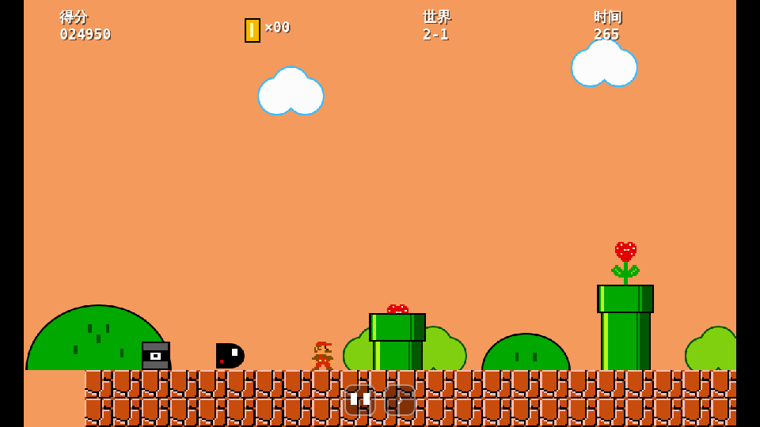
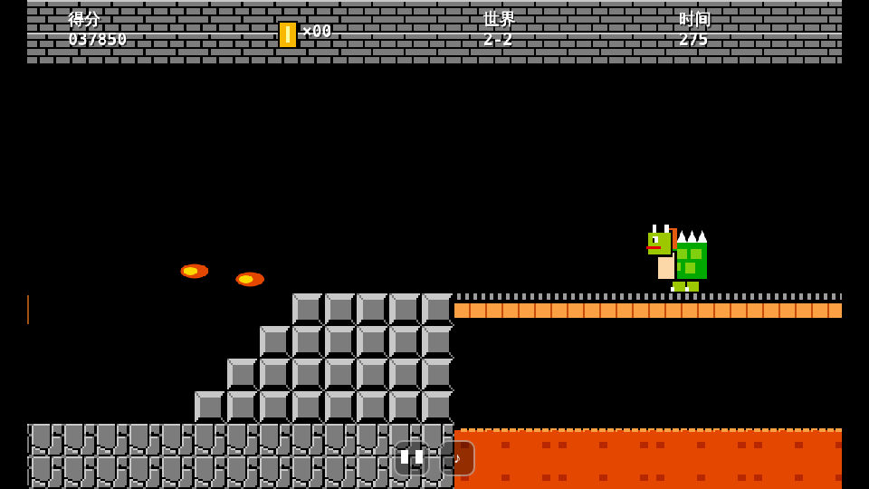
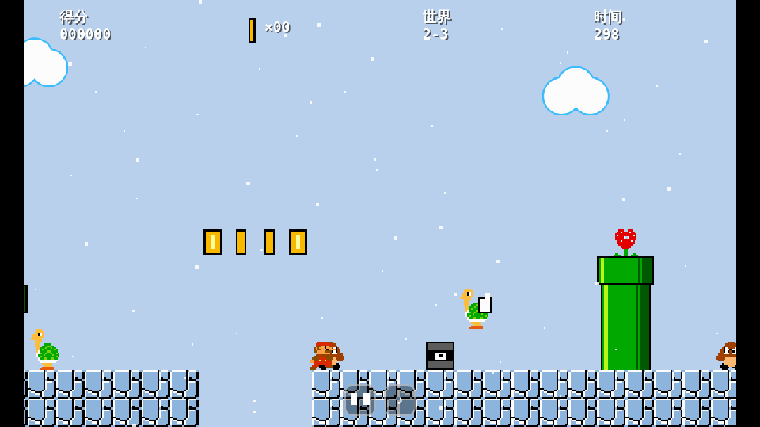
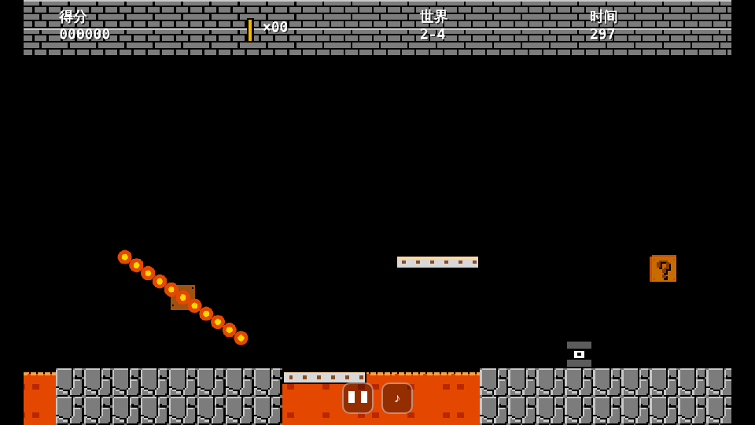
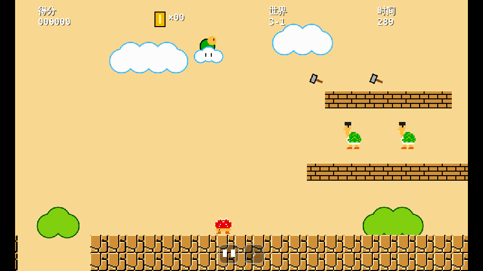
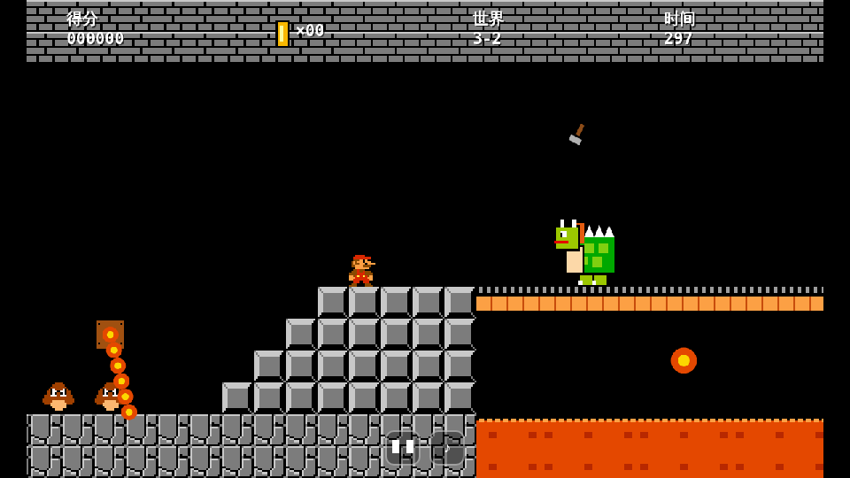

# 超级玛丽 H5

用原生 HTML5 Canvas + JavaScript 写的横版闯关小游戏，分三个世界，一共十一关。没有依赖，也不用构建，手机和电脑浏览器都能玩。


## 在线试玩

https://imcodingman.github.io/SuperMario/ （手机浏览器直接打开即可）

## 操作

| 操作 | 键盘 | 触屏 |
| --- | --- | --- |
| 移动 | ← → / A D | 左下方向键（手指可以滑动切换方向） |
| 跳跃（按得越久跳得越高） | Z / 空格 / ↑ / W | 右下 A 键 |
| 加速跑 | 不用按键：朝同一方向一直走，约 1 秒后自动加速 | 同左 |
| 暂停 | P / Esc | ❚❚ 按钮 |
| 静音 | M | ♪ 按钮 |

手机横屏时画面会自动变宽，看得更远；竖屏也能玩。切到别的应用时游戏会自动暂停。

**在微信里玩：** 微信、QQ 等 App 自带的浏览器不跟着手机转屏，所以在这些 App 里竖着打开时，游戏会自动把画面转 90 度，把手机逆时针横过来拿（手机顶部朝左）就是横屏。想临时切回竖屏，点画面下方的「竖屏」按钮；下次打开还是默认横屏。在其他浏览器里竖屏玩时，也可以点「横屏」按钮手动切换。


## 关卡

每关抓完旗杆（城堡关是碰到斧头）会直接进入下一关，分数、金币、剩余命数和变大状态都会带过去。世界 2、世界 3 比世界 1 难：倒计时只有 300，敌人走得更快，还有新的机关和敌人，越往后越难。

| 关卡 | 场景 | 主要内容 |
| --- | --- | --- |
| 1-1 | 地上 | 水管、砖块、问号砖、台阶、坑洞，终点有旗杆和城堡 |
| 1-2 | 地下 | 蓝色砖块和天花板、高低石柱、双层砖块走廊、横跨大坑的砖桥、满地金币，出口回到地面抓旗杆 |
| 1-3 | 空中 | 只有起点和终点有地面，中间靠高低不一的树顶平台和来回移动的升降平台跳过去 |
| 1-4 | 夜晚 | 星空背景，出现新敌人乌龟：踩一下缩成龟壳，再碰一下把壳踢出去，能一路撞倒其他怪 |
| 1-5 | 城堡 | 岩浆坑、旋转火焰棍、低矮天花板；终点吊桥上有喷火的魔王，绕过它碰到桥尽头的斧头就能过关 |
| 2-1 | 黄昏 | 更宽的坑、更快的敌人；水管里会钻出食人花，炮台朝你发射炮弹 |
| 2-2 | 城堡 | 转得更快更长的火焰棍、从岩浆里跳出来的火球、岩浆上的移动平台、炮台；魔王喷火更频繁，一次喷两颗 |
| 2-3 | 冰雪 | 地面结冰打滑，起步慢、刹车更慢；一蹦一蹦的飞龟、食人花、炮台，坑更多 |
| 2-4 | 熔岩堡垒 | 站上去就往下掉的落下平台、双头火焰棍、几乎连成片的岩浆坑；魔王走得更快、喷火和跳跃都更频繁 |
| 3-1 | 沙漠 | 驾云跟着你丢刺猬的云上刺猬怪、在两层砖块台子上跳上跳下扔锤子的锤子兄弟，还有食人花、炮台、飞龟 |
| 3-2 | 最终要塞（最终关） | 更快的火焰棍、更多双头火焰棍、一连三块的落下平台、城堡里的锤子兄弟；最终魔王除了喷火还会扔锤子 |

| 1-1 地上 | 1-2 地下 | 1-3 空中 |
| --- | --- | --- |
|  |  |  |

| 1-4 夜晚 | 1-5 城堡 |
| --- | --- |
|  |  |

| 2-1 黄昏 | 2-2 城堡 |
| --- | --- |
|  |  |

| 2-3 冰雪 | 2-4 熔岩堡垒 |
| --- | --- |
|  |  |

| 3-1 沙漠 | 3-2 最终要塞 |
| --- | --- |
|  |  |

## 玩法

- **问号砖**：从下面顶出金币或蘑菇
- **蘑菇**：吃了变大，变大后能顶碎砖块；变大时被怪碰到会变回小个子，并有一小段无敌时间
- **栗子怪**：踩头消灭，连续踩不落地分数会越来越高；从下面顶砖块，也能把站在砖块上的怪顶飞
- **乌龟**（1-4 起）：踩一下缩进龟壳；碰到静止的龟壳会把它踢出去，滑行的龟壳撞倒沿途所有敌人，撞得越多分越高。小心被弹回来的龟壳撞到自己；龟壳放着不管，过几秒乌龟会重新钻出来
- **岩浆和火焰棍**（1-5）：掉进岩浆会丢一条命；旋转的火焰棍碰到就受伤
- **魔王**（1-5、2-2、2-4、3-2）：在吊桥上来回走动、跳跃，还会朝你喷火球，踩不死。从它头上跳过去或趁它跳起时从下面钻过去，碰到斧头后吊桥断掉，魔王掉进岩浆。越往后的魔王走得越快、喷火越勤，2-2 起一次喷两颗（一颗追着你的高度飞，另一颗贴着吊桥平飞），3-2 的魔王还会朝你扔锤子
- **食人花**（2-1）：定时从水管里钻出来，碰到就受伤，踩不死。站在水管旁边或上面时它不会钻出来
- **炮台**（2-1、2-2）：朝你所在的方向发射炮弹。贴地的炮弹要跳过去，高一点的炮弹只打得到大个子；从上面踩炮弹能把它踩掉
- **岩浆火球**（2-2、2-4）：隔一会儿从岩浆里跳出来再落回去，看准时机再跳过岩浆坑
- **冰面**（2-3）：起步慢、松开方向键后还会往前滑好几格，靠近坑边要提前松手
- **飞龟**（2-3）：一边前进一边蹦跳，踩一下掉翅膀变成普通乌龟，再踩就缩成龟壳
- **落下平台**（2-4、3-2）：灰白色的平台，站上去约半秒后开始抖动下落，要赶紧跳到下一块；普通的橙色平台不会掉
- **双头火焰棍**（2-4、3-2）：同一个中心伸出两根火焰棍，像螺旋桨一样转，空档更小
- **锤子兄弟**（3-1、3-2）：戴黑头盔的乌龟，在砖块台子的上下层之间跳来跳去，不停朝你抛锤子。锤子走抛物线，碰到就受伤；可以踩掉它
- **云上刺猬怪**（3-1）：驾着云在你头顶来回飞，隔一会儿丢一只刺猬下来。它飞得很高，一般够不着，要一路躲着刺猬走；踩掉它过一会儿还会再来
- **刺猬**（3-1）：背上长刺，**踩了会受伤**，只能跳过去，或者用踢出去的龟壳撞掉、从下面顶砖块顶飞
- **金币**：1-2 和 1-3 里有直接摆着的金币，碰到就吃；每集满 100 个金币奖励一条命
- **升降平台**（1-3）：有左右移动的，也有上下移动的，站上去会跟着走；只能从上面跳上去，从下面往上跳会穿过去
- **倒计时**：世界 1 每关 400，世界 2 每关 300；剩 100 时音乐加快，归零会丢一条命
- **存档点**：每关中段有一个，过了之后死掉会从这里复活
- **结算**：抓旗杆的位置越高分数越多，剩余时间也会换算成分数
- **最高分**：保存在当前浏览器里（localStorage）
- 一开始有 3 条命，命用完就游戏结束，回到标题画面
- **选关**：进入过的关卡会自动解锁（记在当前浏览器里）。标题画面会出现「选关 ◀ 2-1 ▶」，点两边的箭头、按方向键或触屏方向键切换，默认选中打到的最远一关；点屏幕其他地方、按 A 或回车就从这一关开始。从中间开始时是 3 条命、小个子、分数从 0 算起

小彩蛋：在 1-2 里变大后可以顶碎天花板，跳到天花板上面走捷径。

## 本地运行

直接用浏览器打开 `index.html`，或者起一个静态服务器：

```bash
python3 -m http.server 8000
# 访问 http://localhost:8000
```

## 部署

游戏只有 `index.html` 和 `game.js` 两个文件，放到任意静态托管上就行（GitHub Pages、OSS、Nginx 等都可以）。

这个仓库用的是 GitHub Pages：Settings → Pages，Source 选 “Deploy from a branch”，分支选 `claude/h5-super-mario-game-8y9xh2`，目录选 `/ (root)`。之后每次推送到这个分支，网站都会自动更新。仓库里的 `.nojekyll` 让 GitHub 把文件原样发布，不做额外处理。

## 文件结构

```
index.html   页面、样式、虚拟按键
game.js      游戏全部逻辑：渲染、物理、关卡、音效
docs/        README 里用到的截图
```

## 添加新关卡

关卡都定义在 `game.js` 的 `LEVELS` 数组里，按数组顺序依次闯关。每一关是一个对象：

```js
{
  name: '2-3',               // 画面上显示的关卡名
  song: 0,                   // 背景音乐：0 地上、1 地下、2 空中、3 城堡
  ugEnd: 0,                  // 地下区域结束的列；0 表示整关都在地上
  sky: '#141e4c',            // 可选，天空颜色
  stars: true,               // 可选，画星星
  checkpoint: [90, 12],      // 存档点 [列, 站立行]，地面上站立行是 12
  deco: [...],               // 背景装饰：hill / bush / cloud
  enemies: [[22, 12], [30, 12, 'koopa']],  // 敌人 [列, 站立行, 类型]：不写是栗子怪，'koopa' 乌龟，'para' 飞龟，'hammer' 锤子兄弟，'spiny' 刺猬
  platforms: [...],          // 可选，平台：axis 'x' 左右移动、'y' 上下移动、'fall' 落下平台
  theme: 'snow',             // 可选，主题：'castle' 城堡、'snow' 冰雪（配合 snow: true 飘雪、ice: true 冰面打滑）、'desert' 沙漠
  lakitu: { from: 26, to: 176 },  // 可选，云上刺猬怪出没的列范围
  firebars: [[26, 9, 6, 1]], // 可选，火焰棍 [中心列, 中心行, 火球数, 方向, 起始角度]
  piranhas: [30, 38],        // 可选，会钻出食人花的水管（水管左列）
  cannons: [[52, 12]],       // 可选，炮台 [列, 炮口行]，下面自动垫石块
  podoboos: [11, 26],        // 可选，会从岩浆里跳出火球的列
  time: 300,                 // 可选，倒计时，默认 400
  enemySpeed: 0.75,          // 可选，敌人速度，默认 0.5
  firebarSpeed: 0.045,       // 可选，火焰棍转速，默认 0.03
  boss: { x: 186, min: 181, max: 190, fireRate: 80, double: true, hop: 70, speed: 0.8, hammers: true },
                             // 可选，魔王；有魔王的关卡用斧头代替旗杆
                             // fireRate 喷火间隔（帧），double 一次喷两颗，hop 跳跃间隔，speed 走路速度，hammers 会扔锤子
  build() {                  // 用下面的小工具搭地形
    groundWithGaps([[69, 70]]);
    pipe(28, 2);
    setT(16, 9, QCOIN);
    // ...
  },
}
```

- 画面高 15 行，第 13、14 行是地面，行号越小越高。
- 每关宽 212 列，旗杆固定在第 198 列，城堡在第 202 列。
- 搭地形的小工具：`groundWithGaps`（地面，可留坑）、`row`（一排图块）、`pipe`（水管）、`stairs`（台阶）、`tree`（树顶平台），`cannon`（炮台），以及直接放单个图块的 `setT`。
- 可用的图块：`BRICK` 砖块、`QCOIN` 出金币的问号砖、`QMUSH` 出蘑菇的问号砖、`BRICK_COINS` 能连续顶出金币的砖块、`HARD` 石块、`COIN` 金币、`LAVA` 岩浆、`BRIDGE` 吊桥、`AXE` 斧头、`CANNON` 炮口。
- 新关卡加在 `LEVELS` 最后，就会成为新的最终关；想插在中间，就放到数组里对应的位置。

## 说明

这是一个仿照经典横版闯关玩法的个人练习项目。所有像素图都用代码绘制，音效和四首背景音乐都是原创旋律，用 WebAudio 实时合成，没有使用任何原版素材。
